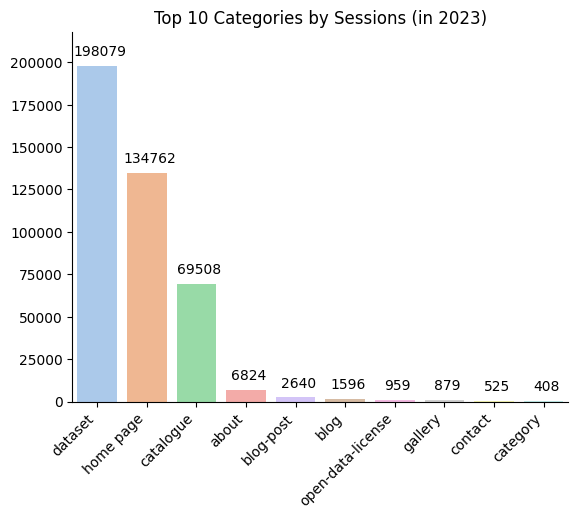

# Web Analytics for City of Toronto's Open Data Portal (2023 - 2024)
Analysis by: Jinesh Dutt, Rishabh Kaushick
<br>Supervised by: Dr. Omar Badreldin

## Aim
1. To analyze and visualize the existing data.
2. To identify external events or data sources to enhance visualizations.
3. To discover trends in the data to gain insights on how the data may change over time.

## Data

**Page Views Over Time**
| # |  Column                    | Non-Null Count  | Data Type  |
|---|----------------------------|-----------------|------------|
| 0 | Link Source -Page URL      | 156033 non-null | object     |
| 1 | Date                       | 155033 non-null | object     |
| 2 | Sessions                   | 156033 non-null | int64      |
| 3 | Users                      | 156033 non-null | int64      |
| 4 | Views                      | 156033 non-null | int64      |
| 5 | Avg Session Duration (Sec) | 156033 non-null | float64    |
| 6 | Views per Session          | 156033 non-null | float64    |
| 7 | Bounce Rate %              | 156033 non-null | float64    |


**Referrers Over Time**
| # | Column           | Non-Null Count | Data Type  |
|---|------------------|----------------|------------| 
| 0 | Referring Domain | 24469 non-null | object     |
| 1 | Date             | 23469 non-null | object     |
| 2 | Sessions         | 24469 non-null | int64      |
| 3 | Users            | 24469 non-null | int64      |
| 4 | Views            | 24469 non-null | int64      |


**Search Terms Over Time**
| # | Column                         | Non-Null Count | Data Type |
|---|--------------------------------|----------------|-----------| 
| 0 | Search Term -Generic (search=) | 56028 non-null | object    |
| 1 | Date                           | 55327 non-null | object    |
| 2 | Views                          | 56327 non-null | int64     |


**Views Per IP Over Time**
| # | Column                     | Non-Null Count | Data Type |  
|---|----------------------------|----------------|-----------| 
| 0 | Client IP                  | 24390 non-null | object    |
| 1 | Date                       | 23390 non-null | object    |
| 2 | Views                      | 24390 non-null | int64     |
| 3 | Avg Session Duration (Sec) | 24390 non-null | float64   |
| 4 | OD - File Download Clicks  | 24390 non-null | int64     |
| 5 | Sessions                   | 24390 non-null | int64     |


**Page Views Metadata**
| # |  Column                    |Non-Null Count| Data Type |
|---|----------------------------|--------------|-----------| 
| 0 |  author                    |511 non-null  | object    |
| 1 |  author_email              |511 non-null  | object    |
| 2 |  civic_issues              |138 non-null  | object    |
| 3 |  creator_user_id           |514 non-null  | object    |
| 4 |  dataset_category          |514 non-null  | object    |
| 5 |  date_published            |514 non-null  | object    |
| 6 |  excerpt                   |513 non-null  | object    |
| 7 |  formats                   |514 non-null  | object    |
| 8 |  id                        |514 non-null  | object    |
| 9 |  information_url           |367 non-null  | object    |
| 10|  is_retired                |488 non-null  | object    |
| 11|  isopen                    |514 non-null  | bool      |
| 12|  last_refreshed            |514 non-null  | object    |
| 13|  license_title             |380 non-null  | object    |
| 14|  maintainer_email          |511 non-null  | object    |
| 15|  metadata_created          |514 non-null  | object    |
| 16|  metadata_modified         |514 non-null  | object    |
| 17|  name                      |514 non-null  | object    |
| 18|  notes                     |514 non-null  | object    |
| 19|  num_resources             |514 non-null  | int64     |
| 20|  num_tags                  |514 non-null  | int64     |
| 21|  owner_division            |514 non-null  | object    |
| 22|  owner_email               |511 non-null  | object    |
| 23|  owner_org                 |514 non-null  | object    |
| 24|  private                   |514 non-null  | bool      |
| 25|  refresh_rate              |514 non-null  | object    |
| 26|  state                     |514 non-null  | object    |
| 27|  title                     |514 non-null  | object    |
| 28|  topics                    |485 non-null  | object    |
| 29|  type                      |514 non-null  | object    |
| 30|  resources                 |514 non-null  | object    |
| 31|  tags                      |514 non-null  | object    |
| 32|  groups                    |514 non-null  | object    |
| 33|  relationships_as_subject  |514 non-null  | object    |
| 34|  relationships_as_object   |514 non-null  | object    |
| 35|  license_id                |380 non-null  | object    |
| 36|  limitations               |131 non-null  | object    |
| 37|  owner_section             |88 non-null   | object    |
| 38|  owner_unit                |111 non-null  | object    |
| 39|  collection_method         |2 non-null    | object    |
| 40|  url                       |2 non-null    | object    |


## Visualizations

### Top Categories by Views of All Time (2023 & 2024)


<br>
This bar chart captures the top 10 most-viewed categories across 2023 and 2024. Dataset pages overwhelmingly led the portal’s activity, with more than 527,000 views, reinforcing that users primarily come to access and explore open datasets.
The home page and catalogue sections followed behind, with over 321,000 and 256,000 views respectively—showing they remain critical for guiding users into deeper engagement with the portal’s content.
Other categories, including about, blog-post, and open-data-license, received significantly fewer views, indicating that while users occasionally seek contextual information, the portal’s core strength lies in its role as a data discovery and access platform.
This view distribution further highlights the importance of continuously improving dataset searchability, navigation, and homepage experiences to match user priorities.

### Top Categories by Views (2023)


<br>
This bar chart focuses on user activity during 2023 alone. Dataset pages were again the primary driver of engagement, attracting over 231,000 views, well ahead of other sections.
The home page and catalogue followed with 155,000 and 121,000 views respectively, highlighting their crucial role in helping users find and access datasets.
Other content like the about page, blog-posts, and open-data-license received much lower traffic. These findings reinforce that while users occasionally explore background information, their main purpose is direct interaction with datasets.
Maintaining a strong, searchable dataset offering and optimizing the user journey from the homepage to the data remain key priorities based on this usage pattern.

### Top Categories by Views (2024)


<br>
This bar chart highlights portal engagement during 2024. Dataset pages continued to dominate user attention, drawing nearly 296,000 views—an increase compared to 2023, reflecting the growing public interest in open data resources.
The home page and catalogue remained the next most-visited sections with 165,000 and 135,000 views respectively, further emphasizing their role as key navigation and discovery hubs for users.
Supporting sections like about, blog-post, and open-data-license maintained relatively low traffic, underscoring that users primarily visit the portal with the intent to find and interact with datasets rather than explore general informational content.
The continued rise in dataset views signals strong momentum for open data adoption across the city and among the wider community.


### Top Categories by Sessions of All Time (2023 & 2024)


<br>
This chart shows the number of sessions — or visits — across all portal categories during 2023 and 2024 combined. Dataset pages drove the overwhelming majority of sessions, with over 448,000 visits, confirming that data exploration remains the primary reason users visit the portal.
The home page and catalogue also saw strong engagement, recording 278,000 and 146,000 sessions respectively. These sections play a vital role in helping users navigate and find the datasets they need.
Secondary sections like about, blog-post, and open-data-license attracted far fewer sessions, illustrating that while background information is valued by some, the portal’s true strength lies in connecting users directly to datasets.
The data underscores the portal’s continued success as a destination for finding actionable, open government data.

### Top Categories by Sessions (2023)


<br>
This chart shows how user sessions were distributed across portal categories during 2023. Once again, dataset pages dominated, drawing nearly 200,000 sessions, far outpacing all other categories.
The home page recorded around 134,000 sessions, acting as the primary starting point for most users, while the catalogue received about 69,000 sessions, reinforcing its role as a key browsing tool for finding datasets.
Categories like about, blog-post, and open-data-license remained comparatively niche in terms of user sessions, indicating that most users have a direct, data-driven purpose when visiting the portal.
The 2023 trends highlight the growing emphasis on quick access to public datasets and the importance of intuitive navigation tools like the home and catalogue pages.

### Top Categories by Sessions (2024)


<br>
In 2024, dataset pages continued to lead all categories by a wide margin, drawing over 250,000 sessions. This solidifies datasets as the core driver of traffic to the Open Data Portal.
The home page followed with around 143,000 sessions, emphasizing its role as the primary gateway for users to explore available information. The catalogue received close to 77,000 sessions, showing ongoing demand for a structured way to browse datasets.
As in 2023, secondary pages like about, blog-post, and open-data-license had much lower engagement, highlighting that users typically visit the portal with a focused intent to discover data rather than explore informational or background content.
The 2024 traffic patterns confirm a user base that is increasingly goal-oriented, relying heavily on direct access to datasets.

### Top Datasets by Views of All Time (2023 & 2024)


<br>
Among all datasets, the Dogs Issued Dangerous Dog Orders dataset recorded the highest number of views over 2023 and 2024, with over 23,700 views. This reflects significant public interest, especially during periods of heightened discussions around public safety.
Close behind were the Short-Term Rentals Registration dataset with around 23,100 views and Neighbourhood Profiles with approximately 22,500 views, both consistently popular as people searched for local community or housing information.
Other notable datasets like 3D Massing and Outbreaks in Toronto Healthcare Institutions also captured attention, especially during city planning conversations and public health updates.
This overall trend highlights that residents, researchers, and media alike engage most with datasets tied to housing, safety, public health, and community characteristics.

### Top Datasets by Views (2023)


<br>
In 2023, the Short-Term Rentals Registration dataset led the charts with nearly 10,000 views, highlighting public interest in Toronto’s rental market regulations and listings.
Following closely were the 3D Massing dataset (8,874 views) and Neighbourhood Profiles (8,060 views), showing sustained attention toward urban planning and local community insights.
Public health remained a key focus too, with Outbreaks in Toronto Healthcare Institutions receiving over 6,400 views.
Datasets related to elections, daily shelter occupancy, and traffic volumes also garnered notable attention, reflecting the city's growing reliance on open data for civic engagement and urban mobility awareness.

### Top Datasets by Views (2024)


<br>
In 2024, the Dogs Issued Dangerous Dog Orders dataset saw a significant spike, leading all datasets with an impressive 23,716 views. This highlights increased community interest in animal safety and regulations.
Neighbourhood Profiles and Short-Term Rentals Registration followed, each attracting over 14,000 and 13,000 views respectively, confirming ongoing demand for local area information and rental market data.
The 3D Massing dataset also remained a strong performer, emphasizing the public's continued fascination with urban development projects.
Other datasets like Healthcare Outbreaks, Traffic Volumes, and Animal Shelter Activity rounded out the top 10, reflecting a diversified public interest across civic life, mobility, and welfare.

### Top Datasets by Sessions of All Time (2023 & 2024)


<br>
When looking at total sessions across 2023 and 2024, the Short-Term Rentals Registration dataset led the way with 18,860 sessions, just slightly ahead of Dogs Issued Dangerous Dog Orders at 18,389 sessions.
Neighbourhood Profiles and 3D Massing datasets followed closely, reflecting continued user engagement with local community and development-related information.
Datasets related to Healthcare Outbreaks, Shelter Activities, and Traffic Volumes also saw strong and consistent interest, showing that users are actively engaging with public health, social services, and transportation data.

### Top Datasets by Sessions (2023)


<br>
In 2023, the Short-Term Rentals Registration dataset topped the list with 8,581 sessions, highlighting strong public interest in housing and rental activities.
Following closely were 3D Massing and Neighbourhood Profiles, as users explored detailed spatial and community information.
Health-related datasets like Outbreaks in Toronto Healthcare Institutions also saw notable engagement, alongside civic-focused data such as Election Results and Shelter Occupancy.
The trend suggests that users in 2023 were especially drawn to datasets related to city living, public services, and community planning.

### Top Datasets by Sessions (2024)


<br>
In 2024, the Dogs Issued Dangerous Dog Orders dataset saw the highest engagement with 18,389 sessions, reflecting a strong public focus on safety and animal control.
Neighbourhood Profiles and Short-Term Rentals Registration followed closely, indicating continued community interest in localized living data and housing information.
Other datasets such as 3D Massing and Outbreaks in Toronto Healthcare Institutions remained popular, showing a consistent user demand for urban planning and health-related information.
Compared to 2023, 2024 saw a broader spread of user interest across multiple public service areas, suggesting deeper and more diverse data exploration habits among users.

### Top Datasets by Users of All Time (2023 & 2024)


As expected, the "Dogs Issued Dangerous Dog Orders" dataset topped the chart with 16,188 users. "Short-Term Rentals Registration" and "Neighbourhood Profiles" followed closely behind. Additionally the urban planning and design remained a key theme with “3D Massing” receiving over 8,000 users.

The 'Users' metric is flawed. By design, the people who visit the Open Data Portal are not required to sign up. Therefore the IP Address is used to track unique users. It is possible for people to change their IP Address through VPN software, hence this metric will not be used for future visualizations.

### Datasets Over Time


| Month     | 2023_Sessions | 2024_Sessions | Percentage_Change |
|-----------|---------------|---------------|-------------------|
| January   | 15,076        | 22,476        | + 49.08%          |
| February  | 15,457        | 18,636        | + 20.57%          |
| March     | 22,192        | 24,226        | + 9.17%           |
| April     | 15,104        | 32,304        | + 113.88%         |
| May       | 12,535        | 16,178        | + 29.06%          |
| June      | 16,546        | 16,880        | + 2.02%           |
| July      | 14,298        | 15,215        | + 6.41%           |
| August    | 12,341        | 12,366        | + 0.2%            |
| September | 17,474        | 25,738        | + 47.29%          |
| October   | 21,000        | 23,995        | + 14.26%          |
| November  | 22,981        | 28,418        | + 23.66%          |
| December  | 13,075        | 14,120        | + 7.99%           |

From the graph and table above, we can see that in 2024, the City of Toronto’s Open Data portal saw a consistent increase in dataset session activity compared to 2023, with the most significant spike in April. This spike in April corresponds perfectly with the dogs-issued-dangerous-dog-orders dataset as shown [here](#monthly-engagement-with-top-dataset-pages-2024). Overall, monthly sessions in 2024 outperformed those in 2023 across nearly all months, indicating improved engagement with the portal.


### Overall Portal Traffic by Category


This donut chart gives a full view of where users spent their time across the Open Data Portal. Dataset pages dominated traffic, accounting for the majority of all sessions—clearly showing that users visit the portal mainly to explore and access data.
The home page remained the second-largest area of activity, acting as the main gateway for users to navigate deeper into the portal. Catalogue pages, which allow users to browse available datasets, were the next most-visited section.
Other categories like about, blog, and open-data-license pages made up only a small slice of overall traffic, reinforcing that users are primarily goal-driven: they come to find data, not to browse informational content.


### Word Cloud of Search Terms (2023)


The top search terms by percentage contribution in 2023:

| Search Term            | Frequency | Percentage |
|------------------------|-----------|------------|
| elections              | 4,218     | 8.91%      |
| ttc                    | 1,322     | 2.79%      |
| 3d massing             | 1,199     | 2.53%      |
| neighbourhood          | 1,046     | 2.21%      |
| housing                | 1,024     | 2.16%      |
| traffic                | 749       | 1.58%      |
| 3d                     | 672       | 1.42%      |
| campaign contribution  | 670       | 1.42%      |
| rent reductions        | 614       | 1.30%      |
| crime                  | 587       | 1.24%      |

<br>
As we can see in the table and word-cloud above, in 2023, “elections” dominated the search interest in the Open Data portal (8.91%), followed by terms like "TTC", "3D massing" and "neighbourhood".

### Search Term Views Over Time (2023)

<br>

In 2023, search activity for “elections” showed a dramatic spike in June which is likely related to Toronto's Mayoral By-Election on June 26, 2023. 
Here is the [Statement from Toronto City Clerk's Office](https://www.toronto.ca/news/statement-from-toronto-city-clerk/).


### Word Cloud of Search Terms (2024)


The top search terms by percentage contribution in 2024:

| Search Term                    | Frequency | Percentage |
|--------------------------------|-----------|------------|
| ttc                            | 1,450     | 2.93%     |
| housing                        | 1,151     | 2.33%     |
| traffic                        | 903       | 1.83%     |
| 3d massing                     | 898       | 1.82%     |
| elections                      | 833       | 1.69%     |
| transportation                 | 829       | 1.68%     |
| neighbourhood                  | 744       | 1.51%     |
| boundary                       | 717       | 1.45%     |
| former municipality boundaries | 713       | 1.44%     |
| street tree data               | 632       | 1.28%     |

<br>
In 2024, the search behavior shifted toward more transport, infrastructure and planning-related topics, with "TTC" followed by "housing", and "traffic".

### Search Term Views Over Time (2024)


As discussed previously, user interest was more evenly distributed across top terms like TTC and housing. Interestingly elections also saw noticeable peaks in June and November '24. However, these were significantly lesser searches comapred to 2023. The likely reason behind interest in election in June was likely due to the [Federal By-Election in the electoral district of Toronto-St. Paul](https://www.pm.gc.ca/en/news/news-releases/2024/05/19/prime-minister-announces-election-toronto-st-pauls) on June 24, 2024. In November again there were the [Toronto Muncipal By-Elections for Don Valley West](https://www.toronto.ca/wp-content/uploads/2024/11/9727-Declaration-of-Results-for-the-Councillor-Ward-15-ByElectionfor-posting.pdf) on November 4, 2024, which likely resulted in the second spike.

### Top 10 Owner Divisions by Views (2023)

<br>

Based on the metadata of the datasets, we can further categorize them based on their 'Owner Division' in the city. Through the graph, we can see the top 5 divisions having a similar consistent monthly activity, with over 19k views.

### Top Owner Divisions Over Time (2023)

As discussed previously, a very sharp spike occurred in June for the City Clerk’s Office, likely driven by the 2023 Toronto Mayoral By-Election, pushing it briefly to the top. Transportation Services and Social Development, Finance & Administration maintained high engagement throughout the year, with strong peaks in March and October.

### Top 10 Owner Divisions by Views (2024)

<br>

The standout event was an explosive spike in April for Municipal Licensing & Standards, with over 21,000 views, potentially linked to permit cycles or regulatory changes.

### Top Owner Division Over Time (2024)

<br>

Viewership patterns in 2024 were more volatile, with higher highs but sharper drops between months compared to 2023. 'Planning' and 'Information & Technology' saw moderate, steady attention, while Transportation Services had stable mid-level activity across the year. Social Development held a consistent presence, peaking in March and November <br>

### Distribution of Civic Issues by Views (2023)

### Distribution of Civic Issues by Views (2024)


#### Compaing Distribution of Civic Issues in 2023 & 2024

|         civic_issues | 2023_Views | 2024_Views | Percent_Change |
|----------------------|------------|------------|----------------|
|             Mobility |     22,163 |     25,175 |       + 13.59% |
|    Poverty reduction |     11,973 |     13,166 |        + 9.96% |
|   Affordable housing |      9,197 |      9,977 |        + 8.48% |
|       Climate change |      6,107 |      7,320 |       + 19.86% |
|Fiscal responsibility |      3,884 |      4,628 |       + 19.16% |

Further based on the metadata of the datasets, we can see which dataset is associated with which specific civic issue. From the above graphs, and table we can see that mobility remains the dominant concern, reflecting ongoing focus on transit and road infrastructure. Poverty civic issue has a similar number of views in both years.


### File Download Activity by Day of the Week


<br>
This pie chart highlights when users were most actively downloading files from the Open Data Portal. Downloads were heavily concentrated during the workweek, with Tuesday, Wednesday, and Thursday together accounting for the majority of file downloads.
Tuesday led as the single busiest day for downloads, followed closely by Thursday and Wednesday, showing a strong midweek engagement pattern. Monday and Friday also contributed significantly but slightly less than midweek peaks.
In contrast, Saturday and Sunday saw minimal file download activity, reinforcing the trend that users primarily engage with open data during regular work or research days rather than on weekends.

### Trends in File Download Activity (2023–2024)
.png)

<br>
This area chart shows how file download activity on the Open Data Portal evolved from early 2023 through the end of 2024. Downloads started relatively steady in early 2023, with a slight dip midyear, but momentum picked up sharply toward the end of 2023—growing from 910 clicks in July 2023 to 1,520 clicks by October 2023.
This upward trend continued into 2024, with significant growth through the spring and a major spike in October 2024 reaching 3,734 downloads—the highest point across the two years. After this peak, downloads tapered off slightly but remained well above early 2023 levels.
The steady rise suggests increasing public interest and trust in the portal’s datasets, possibly fueled by expanded data offerings, enhanced visibility efforts, or major civic initiatives that drove people to actively download and use open data resources.

### Distribution of Sessions by URL Category (2023)
.png)

<br>
This donut chart shows how visitors interacted with different sections of the Open Data Portal in 2023. Nearly half of all sessions (47.5%) were focused on dataset pages, highlighting continued interest in exploring and accessing raw data. The home page accounted for about 32% of traffic, serving as a common entry point. Meanwhile, the catalogue section—used to browse available datasets—saw a strong 17% of sessions. Other areas like the “about” and “contact” pages made up a small share of overall visits.
This distribution suggests users are primarily visiting the portal to explore datasets directly, with the homepage and catalogue serving as key navigation hubs.

### Distribution of Sessions by URL Category (2024)
.png)

<br>
In 2024, dataset pages continued to dominate user activity, drawing over 51% of all sessions—an increase from the previous year. The home page remained the second most visited area, accounting for just under 30% of all traffic, while the catalogue section captured 15.8% of sessions.
Other parts of the site, including informational pages like “about” and “category,” had relatively minor engagement. This growing share of dataset traffic reflects a clear and sustained user intent: most visitors come to the portal to directly engage with the city’s open data.

### Monthly Sessions by Referring Category (2023)
.png)

<br>
This line chart highlights how different types of websites drove traffic to the portal throughout 2023. Government and Public Services Sites consistently led as the top referrer, with noticeable spikes in March, October, and November—potentially tied to public service updates or policy announcements.
Toronto City websites also played a strong role, especially in June, when their traffic briefly matched government sites—hinting at a possible coordinated campaign or city-led initiative.
Other referrer categories, including Search Engines, Open Data Portal (Internal), and Uncategorized, brought in lower but steady engagement, rounding out the top five sources of incoming traffic.
This trend reflects the critical role of trusted public and official channels in driving awareness and usage of open data resources.

### Monthly Sessions by Referring Category (2024)
.png)

<br>
In 2024, Government and Public Services Sites once again led as the primary driver of traffic to the Open Data Portal, with a major surge in April reaching over 20K sessions—the highest monthly spike of the year. 

Let's taka a deeper look into these two months.

April '24: <br>
Several news articles (light blue line in the above graph) relating to dog attacks in Toronto such as this one from [CTV News](https://www.ctvnews.ca/toronto/article/officials-to-visit-all-dangerous-dog-owners-in-toronto-as-new-compliance-measures-go-in-effect/) brought in lots of people to the Open Data Potal. There was also an article at the same time in the [Toronto City website](https://www.toronto.ca/news/city-of-toronto-taking-actions-to-address-dangerous-dog-behaviour/) which links to the Dangerous Dog Orders dataset which clearly brought in extra traffic. 


Other categories such as Search Engines, and Uncategorized referrers remained consistently lower but showed subtle increases toward the end of the year, particularly in October and November.
This data reflects the continued importance of official and city-affiliated platforms in driving engagement with open data.

### Monthly Trends by Referring Domain (2023)
.png)

<br>
This graph showcases the top five domains that referred users to the Open Data Portal in 2023. The city's own open.toronto.ca remained the top driver throughout the year, peaking at over 12.5K sessions in November, with earlier spikes in March and June.
www.toronto.ca followed closely behind, showing its strongest performance in June (9.7K sessions), possibly coinciding with city-wide announcements or public consultations.
Other domains—like secure.toronto.ca, google.com, and github.com—had relatively small but steady referral volumes. Their presence suggests broader digital reach, especially from search engines and developer communities.
Together, these trends underline the importance of consistent promotion through official city platforms while highlighting the impact of external discovery through sites like Google and GitHub.

### Monthly Trends by Referring Domain (2024)
.png)

<br>
This chart breaks down the top five individual domains that brought users to the portal in 2024. open.toronto.ca was the leading referrer throughout the year, with a major traffic spike in April, followed by another high in November.
<br>

Let's taka a deeper look into what happened on April 2024: <br> 
Further diving down into a URL level, we can see traffic from the news website CP24, represented by the purple line in the above graph, possibly tied to coverage about dangerous dog orders. Although as of 2025, the article from CP24 that brought the traffic is nowhere to be found, the following [X Tweet](https://x.com/CP24/status/1783251701102698719) talks about the same issue. There was also a similar article at the same time in the [Toronto City website](https://www.toronto.ca/news/city-of-toronto-taking-actions-to-address-dangerous-dog-behaviour/) which links to the Dangerous Dog Orders dataset which clearly brought in extra traffic. 


### Monthly Engagement with Top 5 Non-Dataset Pages (2023)
.png)

<br>
This line chart tracks how users interacted with the top five non-dataset content categories throughout 2023. The home page consistently led all non-dataset sections, peaking in March and again in November—likely reflecting major portal updates or increased promotion periods.
The catalogue category, which helps users discover datasets, showed strong engagement mid-year, with noticeable spikes in March and June, suggesting seasonal patterns in data exploration or recurring public interest campaigns.
Other categories—like about, blog-post, and blog—received lower, steady traffic throughout the year. Their engagement levels remained relatively flat, indicating that users tend to focus more on functional navigation (e.g., homepage or catalogue) rather than informational or editorial pages.
These patterns highlight how users prioritize access to core datasets and entry points when exploring the Open Data Portal.

### Monthly Engagement with Top 5 Non-Dataset Pages (2024)
.png)

<br>
This line graph tracks user activity across the top five non-dataset categories on the portal throughout 2024. As in previous years, the home page remained the most visited section, maintaining steady traffic with small peaks in March and November, suggesting periodic boosts in promotion or new content releases.
The catalogue page, used for browsing available datasets, saw a sharp rise in September and October, with a high of 8.8K sessions—a potential result of seasonal data interest or targeted city initiatives during that time.
Lower-traffic sections such as about, blog-post, and open-data-license remained consistent but minimal in engagement, reflecting their role as supporting or static content.
Overall, users continue to rely most heavily on the homepage and catalogue to navigate and explore Toronto’s open data offerings.

### Weekly Engagement Patterns for Top Non-Dataset Pages (2023)
.png)

<br>
This line graph shows how user interactions with non-dataset sections varied across the days of the week in 2023. The home page dominated traffic throughout the week, with peak sessions occurring mid-week—Tuesday through Thursday—before dropping off significantly over the weekend.
The catalogue section, where users explore available datasets, followed a similar trend, with highest engagement on Tuesday and a noticeable dip on Saturday.
Other non-dataset pages like about, blog-post, and blog maintained lower but steady engagement, showing slight increases during weekdays and reduced traffic on Fridays and weekends.
Overall, the chart highlights a strong weekday usage pattern, with users most active mid-week—likely reflecting higher interest during standard work or research hours.

### Weekly Engagement Patterns for Top Non-Dataset Pages (2024)
.png)

<br>
This chart captures how user sessions on non-dataset pages varied across the week in 2024. As expected, the home page drew the most traffic, with the highest engagement seen mid-week on Tuesday and Wednesday (~23.3K sessions). A clear drop-off begins Friday and continues into the weekend, with the lowest point on Saturday.
The catalogue category followed a similar pattern, peaking at 13.8K sessions midweek before dipping significantly on Saturday (5.5K)—suggesting that data exploration remains primarily a weekday activity.
Other pages like about, blog-post, and open-data-license maintained low but steady usage throughout the week, with slight bumps on weekdays and reduced activity over the weekend.
This weekday-focused usage trend reinforces that most engagement happens during standard work and research days, especially when users are actively navigating to datasets.

### Top Downloaded Datasets (2023)


### Monthly Engagement with Top Dataset Pages (2023)
.png)

<br>
This graph illustrates how interest in specific datasets shifted month-to-month throughout 2023. The short-term rentals registration dataset saw dramatic spikes in June (1,520 sessions) and October (1,275 sessions), likely reflecting public or policy-driven attention on housing and rental activity.
The outbreaks in Toronto healthcare institutions dataset also rose sharply toward the end of the year, with a high of 936 sessions in November, suggesting renewed public health interest or media coverage.
Meanwhile, datasets like neighbourhood profiles, 3D massing, and neighbourhoods maintained more consistent levels of engagement, though neighbourhood profiles had a noticeable peak in March, possibly aligning with community planning or civic engagement campaigns.
This chart highlights how city events, seasonal planning, and public issues drive traffic to specific datasets, underscoring the real-world impact of open data consumption patterns.

### Top Downloaded Datasets (2024)


### Monthly Engagement with Top Dataset Pages (2024)
.png)

<br>
In 2024, the dogs-issued-dangerous-dog-orders dataset saw a dramatic spike in April, reaching 15,000 sessions—by far the highest single-month dataset traffic of the year. This surge likely coincides with heightened public attention or a city council debate around pet safety regulations. 
<br>

The dots were further connected when looking at the refferer domains, i.e. the websites where people came from to visit the Open Data portal, [here](#monthly-sessions-by-referring-category-2024). 

<br>
Following the peak, engagement with that dataset dropped sharply, while overall interest in other datasets remained more stable. The short-term rentals registration dataset peaked in September with 1,800 sessions, reflecting seasonal housing interest or regulatory changes.
Datasets like neighbourhood profiles, outbreaks in Toronto healthcare institutions, and 3D massing maintained consistent but modest engagement across the year, each contributing to steady ongoing public exploration of local data.
This chart underscores how public discourse and civic events can sharply drive demand for specific datasets—sometimes turning niche topics into high-traffic content.

### Weekly Engagement with Popular Datasets (2023)
.png)

<br>
This chart explores how users engaged with top datasets across different days of the week in 2023. The short-term rentals registration dataset saw its highest activity on Wednesday (1,863 sessions) and Thursday (1,615 sessions), suggesting midweek is the prime time for users exploring housing-related content.
Outbreaks in Toronto healthcare institutions spiked on Thursday (1,282 sessions)—possibly aligned with weekly reporting or public health briefings. Similarly, 3D massing and neighbourhoods maintained strong weekday usage, with both peaking midweek and tapering off into the weekend.
Across all datasets, traffic consistently dropped on Saturday and Sunday, confirming a clear weekday engagement pattern—likely driven by workday research, civic planning, or institutional use.

### Weekly Engagement with Popular Datasets (2024)
.png)

<br>
This chart shows how users engaged with key datasets throughout the week in 2024. The dogs-issued-dangerous-dog-orders dataset clearly stood out, spiking dramatically midweek with 6.1K sessions on Wednesday and 5.7K sessions on Thursday, before declining sharply into the weekend. This midweek surge suggests the dataset attracted attention during working days, likely tied to city council discussions or public safety campaigns.
Other datasets like neighbourhood profiles, short-term rentals registration, and outbreaks in Toronto healthcare institutions showed steadier patterns, peaking slightly around midweek and decreasing during Saturdays and Sundays.
As with previous years, the overall trend reveals that dataset exploration is highest during weekdays, reinforcing the role of open data in supporting professional, academic, and civic research during the traditional workweek.


## Documentation
### Data Cleaning
1. For each dataset - segregated summary rows & non summary rows into two different sheets.
2. Extracted the date:
   1. month, day and year: for easy future analysis with respect to date
   2. day of the week: for example Mon, Tue, Wed
3. In the user-ship metrics: Extracted details from 'Link Source Page URL' to understand the base url, which web page is visited, and if it a dataset - which dataset:

For example:
    | Link Source Page URL| Base URL | Category | Category Details 1 | Category Details 2 |
    |---------------------|----------|----------|--------------------|--------------------|
    | open.toronto.ca/dataset/central-intake-calls/{"csv":"77d6e185-90b2-48d0-94c5-e5cf68265c92" |  open.toronto.ca | dataset | central-intake-calls | {"csv":"77d6e185-90b2-48d0-94c5-e5cf68265c92" |
1. In the user-ship metrics: When the 'Link Source -Page URL' did not have category as 'dataset' or 'catalog' or anything specific - it often referred to blog posts. For example the below URL is a blog post:
    ```
    open.toronto.ca/decoding-transit-delays-a-data-driven-dive-into-the-toronto-transit-commission-2014-2022/ 
    ``` 
    Therefore we have updated the Link Source - URL Category to 'blog-post' from the previous value:
     ```
     decoding-transit-delays-a-data-driven-dive-into-the-toronto-transit-commission-2014-2022
     ```
    
