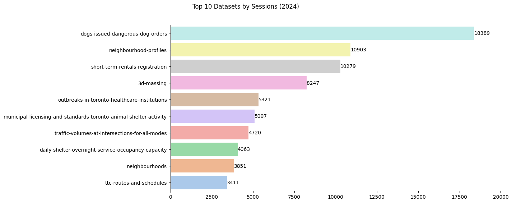

# Web Analytics for City of Toronto's Open Data Portal (2023 - 2024)
Analysis by: Jinesh Dutt, Rishabh Kaushick
<br>Supervised by: Dr. Omar Badreldin

## Aim
1. To analyze and visualize the existing data.
2. To identify external data sources to enhance existing visualizations.
3. To perform predictions on how the data may change over time.

## Data

**Page Views Over Time**
| # |  Column                    | Non-Null Count  | Data Type  |
|---|----------------------------|-----------------|------------|
| 0 | Link Source -Page URL      | 156033 non-null | object     |
| 1 | Date                       | 155033 non-null | object     |
| 2 | Sessions                   | 156033 non-null | int64      |
| 3 | Users                      | 156033 non-null | int64      |
| 4 | Views                      | 156033 non-null | int64      |
| 5 | Avg Session Duration (Sec) | 156033 non-null | float64    |
| 6 | Views per Session          | 156033 non-null | float64    |
| 7 | Bounce Rate %              | 156033 non-null | float64    |


**Referrers Over Time**
| # | Column           | Non-Null Count | Data Type  |
|---|------------------|----------------|------------| 
| 0 | Referring Domain | 24469 non-null | object     |
| 1 | Date             | 23469 non-null | object     |
| 2 | Sessions         | 24469 non-null | int64      |
| 3 | Users            | 24469 non-null | int64      |
| 4 | Views            | 24469 non-null | int64      |


**Search Terms Over Time**
| # | Column                         | Non-Null Count | Data Type |
|---|--------------------------------|----------------|-----------| 
| 0 | Search Term -Generic (search=) | 56028 non-null | object    |
| 1 | Date                           | 55327 non-null | object    |
| 2 | Views                          | 56327 non-null | int64     |


**Views Per IP Over Time**
| # | Column                     | Non-Null Count | Data Type |  
|---|----------------------------|----------------|-----------| 
| 0 | Client IP                  | 24390 non-null | object    |
| 1 | Date                       | 23390 non-null | object    |
| 2 | Views                      | 24390 non-null | int64     |
| 3 | Avg Session Duration (Sec) | 24390 non-null | float64   |
| 4 | OD - File Download Clicks  | 24390 non-null | int64     |
| 5 | Sessions                   | 24390 non-null | int64     |


**Page Views Metadata**
| # |  Column                    |Non-Null Count| Data Type |
|---|----------------------------|--------------|-----------| 
| 0 |  author                    |511 non-null  | object    |
| 1 |  author_email              |511 non-null  | object    |
| 2 |  civic_issues              |138 non-null  | object    |
| 3 |  creator_user_id           |514 non-null  | object    |
| 4 |  dataset_category          |514 non-null  | object    |
| 5 |  date_published            |514 non-null  | object    |
| 6 |  excerpt                   |513 non-null  | object    |
| 7 |  formats                   |514 non-null  | object    |
| 8 |  id                        |514 non-null  | object    |
| 9 |  information_url           |367 non-null  | object    |
| 10|  is_retired                |488 non-null  | object    |
| 11|  isopen                    |514 non-null  | bool      |
| 12|  last_refreshed            |514 non-null  | object    |
| 13|  license_title             |380 non-null  | object    |
| 14|  maintainer_email          |511 non-null  | object    |
| 15|  metadata_created          |514 non-null  | object    |
| 16|  metadata_modified         |514 non-null  | object    |
| 17|  name                      |514 non-null  | object    |
| 18|  notes                     |514 non-null  | object    |
| 19|  num_resources             |514 non-null  | int64     |
| 20|  num_tags                  |514 non-null  | int64     |
| 21|  owner_division            |514 non-null  | object    |
| 22|  owner_email               |511 non-null  | object    |
| 23|  owner_org                 |514 non-null  | object    |
| 24|  private                   |514 non-null  | bool      |
| 25|  refresh_rate              |514 non-null  | object    |
| 26|  state                     |514 non-null  | object    |
| 27|  title                     |514 non-null  | object    |
| 28|  topics                    |485 non-null  | object    |
| 29|  type                      |514 non-null  | object    |
| 30|  resources                 |514 non-null  | object    |
| 31|  tags                      |514 non-null  | object    |
| 32|  groups                    |514 non-null  | object    |
| 33|  relationships_as_subject  |514 non-null  | object    |
| 34|  relationships_as_object   |514 non-null  | object    |
| 35|  license_id                |380 non-null  | object    |
| 36|  limitations               |131 non-null  | object    |
| 37|  owner_section             |88 non-null   | object    |
| 38|  owner_unit                |111 non-null  | object    |
| 39|  collection_method         |2 non-null    | object    |
| 40|  url                       |2 non-null    | object    |


## Visualizations

### Top Categories by Views of All Time (2023 & 2024)

### Top Categories by Views (2023)

### Top Categories by Views (2024)


### Top Categories by Sessions of All Time (2023 & 2024)

### Top Categories by Sessions (2023)

### Top Categories by Sessions (2024)


### Top Datasets by Views of All Time (2023 & 2024)

### Top Datasets by Views (2023)

### Top Datasets by Views (2024)


### Top Datasets by Sessions of All Time (2023 & 2024)

### Top Datasets by Sessions (2023)

### Top Datasets by Sessions (2024)


### Top Datasets by Users of All Time (2023 & 2024)


The 'Users' metric is flawed. By design, the people who visit the Open Data Portal are not required to sign up. Therefore the IP Address is used to track unique users. It is possible for people to change their IP Address through VPN software, hence this metric will not be used for future visualizations.

### Datasets Over Time


| Month     | 2023_Sessions | 2024_Sessions | Percentage_Change |
|-----------|---------------|---------------|-------------------|
| January   | 15,076        | 22,476        | + 49.08%          |
| February  | 15,457        | 18,636        | + 20.57%          |
| March     | 22,192        | 24,226        | + 9.17%           |
| April     | 15,104        | 32,304        | + 113.88%         |
| May       | 12,535        | 16,178        | + 29.06%          |
| June      | 16,546        | 16,880        | + 2.02%           |
| July      | 14,298        | 15,215        | + 6.41%           |
| August    | 12,341        | 12,366        | + 0.2%            |
| September | 17,474        | 25,738        | + 47.29%          |
| October   | 21,000        | 23,995        | + 14.26%          |
| November  | 22,981        | 28,418        | + 23.66%          |
| December  | 13,075        | 14,120        | + 7.99%           |

### Top Downloaded Datasets (2023)

### Top Downloaded Datasets (2024)


### Donut Chart of Top Sessions by URL Categories


<!-- ### (NEEDS UPDATE) Top Referring Domain by Sessions in 2023
UPDATE DONUT CHART FROM POWERBI -->

### Top Referring Domain by Sessions in 2024


### Word Cloud of Search Terms (2023 & 2024)

### Word Cloud of Search Terms (2023)


The top search terms by percentage contribution in 2023:

| Search Term            | Frequency | Percentage |
|------------------------|-----------|------------|
| elections              | 4,218     | 8.91%      |
| ttc                    | 1,322     | 2.79%      |
| 3d massing             | 1,199     | 2.53%      |
| neighbourhood          | 1,046     | 2.21%      |
| housing                | 1,024     | 2.16%      |
| traffic                | 749       | 1.58%      |
| 3d                     | 672       | 1.42%      |
| campaign contribution  | 670       | 1.42%      |
| rent reductions        | 614       | 1.30%      |
| crime                  | 587       | 1.24%      |

### Word Cloud of Search Terms (2024)


The top search terms by percentage contribution in 2024:

| Search Term                    | Frequency | Percentage |
|--------------------------------|-----------|------------|
| ttc                            | 1,450     | 2.93%     |
| housing                        | 1,151     | 2.33%     |
| traffic                        | 903       | 1.83%     |
| 3d massing                     | 898       | 1.82%     |
| elections                      | 833       | 1.69%     |
| transportation                 | 829       | 1.68%     |
| neighbourhood                  | 744       | 1.51%     |
| boundary                       | 717       | 1.45%     |
| former municipality boundaries | 713       | 1.44%     |
| street tree data               | 632       | 1.28%     |

### Search Term Views Over Time (2023)

### Search Term Views Over Time (2024)


Observation: 'elections' search term spikes in the month of June in 2023 and 2024. In 2024, 'elections' again receives high searches in November.

### Top 10 Owner Divisions by Views (2023)

### Top 10 Owner Divisions by Views (2024)


### Top Owner Divisions Over Time (2023)

### Top Owner Division Over Time (2024)


### Distribution of Civic Issues by Views (2023)

### Distribution of Civic Issues by Views (2024)


#### Compaing Distribution of Civic Issues in 2023 & 2024

|         civic_issues | 2023_Views | 2024_Views | Percent_Change |
|----------------------|------------|------------|----------------|
|             Mobility |     22,163 |     25,175 |       + 13.59% |
|    Poverty reduction |     11,973 |     13,166 |        + 9.96% |
|   Affordable housing |      9,197 |      9,977 |        + 8.48% |
|       Climate change |      6,107 |      7,320 |       + 19.86% |
|Fiscal responsibility |      3,884 |      4,628 |       + 19.16% |

## Documentation
### Data Cleaning
1. For each dataset - segregated summary rows & non summary rows into two different sheets.
2. Extracted the date:
   1. month, day and year: for easy future analysis with respect to date
   2. day of the week: for example Mon, Tue, Wed
3. In the user-ship metrics: Extracted details from 'Link Source Page URL' to understand the base url, which web page is visited, and if it a dataset - which dataset:

For example:
    | Link Source Page URL| Base URL | Category | Category Details 1 | Category Details 2 |
    |---------------------|----------|----------|--------------------|--------------------|
    | open.toronto.ca/dataset/central-intake-calls/{"csv":"77d6e185-90b2-48d0-94c5-e5cf68265c92" |  open.toronto.ca | dataset | central-intake-calls | {"csv":"77d6e185-90b2-48d0-94c5-e5cf68265c92" |
1. In the user-ship metrics: When the 'Link Source -Page URL' did not have category as 'dataset' or 'catalog' or anything specific - it often referred to blog posts. For example the below URL is a blog post:
    ```
    open.toronto.ca/decoding-transit-delays-a-data-driven-dive-into-the-toronto-transit-commission-2014-2022/ 
    ``` 
    Therefore we have updated the Link Source - URL Category to 'blog-post' from the previous value:
     ```
     decoding-transit-delays-a-data-driven-dive-into-the-toronto-transit-commission-2014-2022
     ```
    
